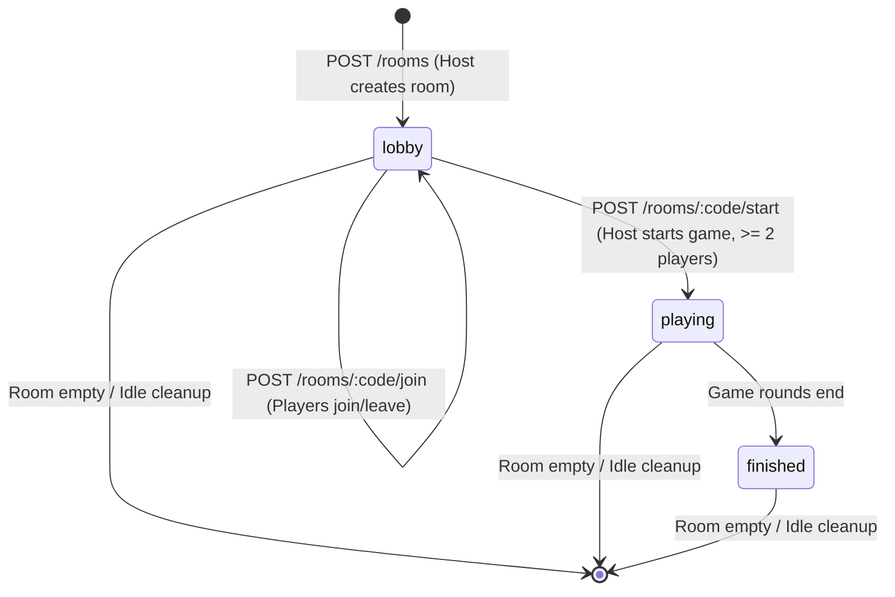

# Data Model Design: Room Setup & Lobby

This document specifies the TypeScript interfaces and validation rules for the entities representing rooms and players.

## Entities

### 1. Participant
Represents an individual player connected to a game room.

```typescript
export interface Participant {
  id: string;          // Cryptographically secure unique ID (UUID)
  name: string;        // Nickname chosen by the player (1-20 chars, trimmed)
  joinedAt: string;    // ISO 8601 timestamp of when the player joined
  
  // Backend Internal Fields (Omitted in client-facing snapshots)
  lastActiveAt?: number; // UNIX timestamp (ms) of the participant's last poll/request
}
```

### 2. Room
Represents the complete state of a game room in server memory.

```typescript
export type RoomStatus = "lobby" | "playing" | "finished";

export interface Room {
  code: string;               // 6-character alphanumeric code (e.g. "3x8F2P")
  status: RoomStatus;         // Current phase of the room lifecycle
  participants: Participant[]; // List of players in chronological join order
  createdAt: string;          // ISO 8601 timestamp of room creation
  updatedAt: string;          // ISO 8601 timestamp of last state modification
}
```

### 3. RoomSnapshot
The filtered representation of the room state transmitted to the client.

```typescript
export type ParticipantRole = "drawer" | "guesser";

export interface RoomSnapshot {
  code: string;                // Room identifier
  status: RoomStatus;          // Current status
  participants: Participant[];  // Active participants list
  availableWords: string[];    // Word bank for gameplay selection
  roles: ParticipantRole[];    // Supported roles
  hostId: string;              // The ID of the current host player (always index 0 of participants)
}
```

## State Transitions



### Transition Validation Rules

1. **Lobby → Playing**:
   - MUST be triggered by the host (`requesterParticipantId === participants[0].id`).
   - The room MUST currently be in `"lobby"` status.
   - The room MUST contain at least 2 participants (`participants.length >= 2`).
2. **Lobby Clean up**:
   - If `participants.length` becomes 0, the room is deleted from the global memory map immediately.
